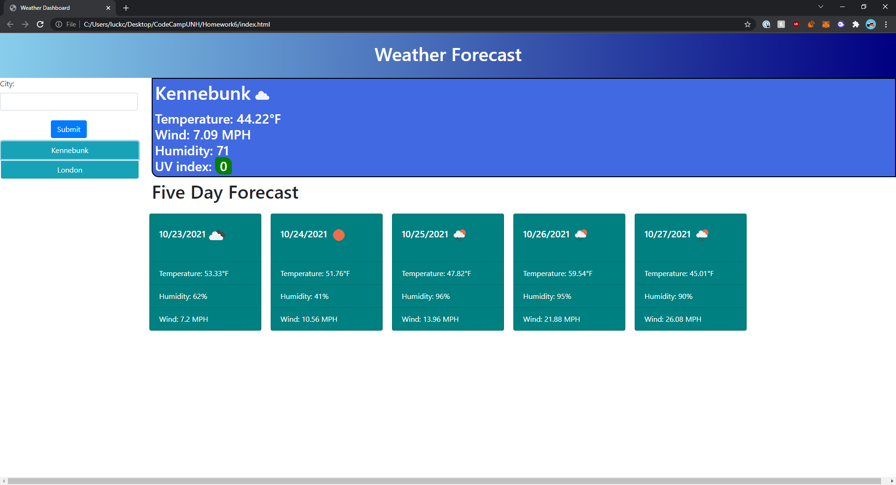

# Weather Dashboard

This projects title is Weather Dashboard and it is a website that I coded the javascript,html,css for using my new found coding skills so that it follows acceptance criteria. 

## Languages

javascript
css
html

## Objective

GIVEN a weather dashboard with form inputs
WHEN I search for a city
THEN I am presented with current and future conditions for that city and that city is added to the search history
WHEN I view current weather conditions for that city
THEN I am presented with the city name, the date, an icon representation of weather conditions, the temperature, the humidity, the wind speed, and the UV index
WHEN I view the UV index
THEN I am presented with a color that indicates whether the conditions are favorable, moderate, or severe
WHEN I view future weather conditions for that city
THEN I am presented with a 5-day forecast that displays the date, an icon representation of weather conditions, the temperature, the wind speed, and the humidity
WHEN I click on a city in the search history
THEN I am again presented with current and future conditions for that city

## What was learned

I learned a lot more about how to use fetch for APIs as well as how to navigate an API and pull data from it with loops and switch case. I also learned a lot more on how to utilize local storage to store data and use the data later on in the program. I got more aquainted with using New Date in js

## Project pictures/websitelink 

Screenshots below!

Link to Weather Dashboard
[Password Generator](https://cluck135.github.io/Weather-Dashboard/)

